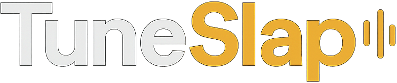
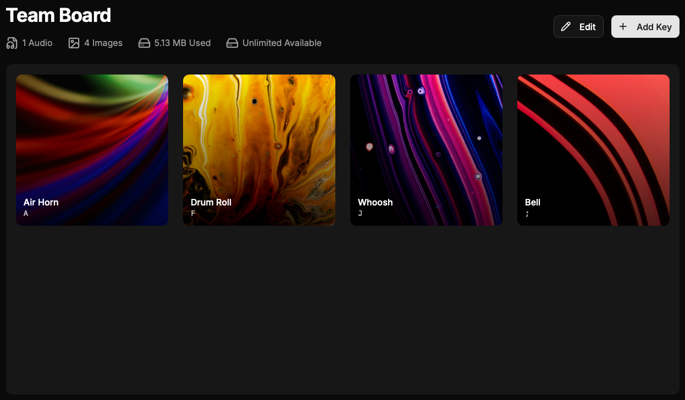

<div align="center">
  
  <p><strong>The collaborative soundboard for modern creators.</strong></p>

  

  <p>
    <a href="https://app.codacy.com/gh/trevv16/tuneslap/dashboard"></a>
    <a href="https://app.codacy.com/gh/trevv16/tuneslap/dashboard"></a>
    <a href="https://go.dev/"></a>
    <a href="https://nextjs.org/"></a>
    <a href="LICENSE"></a>
  </p>

  <p>
    <a href="#quick-start">Quick Start</a> •
    <a href="#for-developers">For Developers</a> •
    <a href="docs/CONTRIBUTING.md">Contributing</a>
  </p>
</div>

---

TuneSlap is a powerful, self-hosted soundboard designed for podcasters, streamers, and production teams. It brings your audio effects to life with instant playback, real-time collaboration, and professional-grade audio manipulation tools—all in your browser.

Say goodbye to clunky desktop apps and rigid file structures. With TuneSlap, you can organize, edit, and play your sounds from anywhere.

## Why TuneSlap?

### 🎛️ Total Control

Customize every aspect of your soundboard. Drag and drop to organize buttons, assign custom images, and set colors to match your workflow.

### 🤝 Built for Teams

Invite your co-hosts and producers to collaborate. Changes happen in real-time, so everyone is always looking at the same board.

### 🎧 Professional Audio Tools

No need for external editors. Trim clips, add fade-in/out effects, adjust playback speed, and loop tracks directly within the app.

### 🔒 Privacy First

Self-hosted and secure. You own your data, your audio files, and your user accounts.

## Quick Start

Get your soundboard running in seconds with Docker.

```bash
# 1. Clone the repository
git clone https://github.com/trevv16/tuneslap.git
cd tuneslap

# 2. Set up your environment
cp server/example.env server/.env

# 3. Launch TuneSlap
docker-compose up -d
```

That's it!

- **App**: [http://localhost:3001](http://localhost:3001)
- **API**: [http://localhost:8082](http://localhost:8082)
- **API Explorer**: [http://localhost:8081](http://localhost:8081)

> **Tip:** Try out the live API at [openapi.tuneslap.com](https://openapi.tuneslap.com) to explore all available endpoints.

For a detailed deployment guide, check out [docs/DEPLOYMENT.md](docs/DEPLOYMENT.md).

## For Developers

TuneSlap is built with a modern, performance-focused stack.

### Frontend

- **Next.js 16** & **React 19** - The latest in modern web development.
- **TypeScript** - For type-safe, maintainable code.
- **TanStack Query** - Efficient data fetching and state management.
- **Web Audio API** - Native browser audio processing.

### Backend

- **Go (Fiber)** - High-performance API server.
- **MongoDB** - Flexible document storage.
- **Redis + Asynq** - Fast caching and background job queues.
- **FFmpeg** - Industrial-strength media processing.

### API & Documentation

Explore the full API documentation in our [OpenAPI explorer](https://openapi.tuneslap.com) or view the specification in `openapi/openapi.yaml`. The explorer lets you browse all endpoints, see request/response schemas, and try out API calls directly.

For details on media uploads, storage, and processing, see the [Media System documentation](docs/media/README.md).

## Contributing

We love contributions! whether it's a bug fix, new feature, or documentation update.
Please read our [Contributing Guidelines](docs/CONTRIBUTING.md) to get started.

## License

TuneSlap is open source software licensed under the [MIT License](LICENSE).
